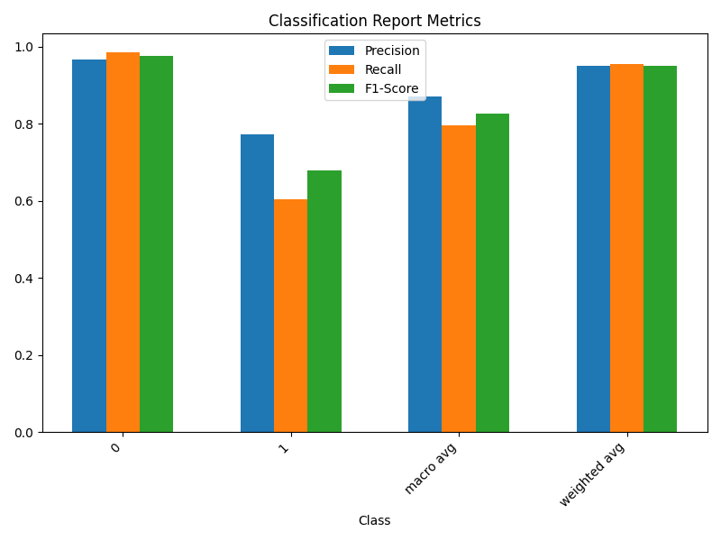
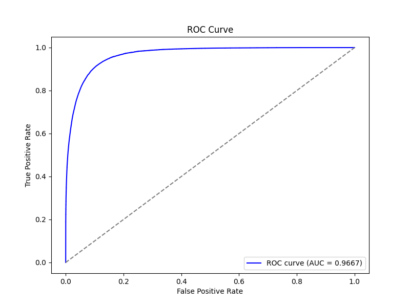

# 仇恨言论检测

## 项目简介
本项目旨在通过深度学习模型检测仇恨言论。模型结合了多种技术，预训练的词嵌入、双向LSTM、注意力机制和多任务学习，以有效捕捉文本中的全局和局部特征，模型结构合理且有较强的表示能力。

## 技术栈
- Python
- TensorFlow / Keras
- GloVe / FastText（词嵌入）

## 模型结构
1. **Embedding层**：使用预训练的词嵌入将输入的词序列转化为固定维度的向量表示。
2. **SpatialDropout1D层**：防止过拟合，对整个嵌入向量进行丢弃。
3. **双向LSTM层**：堆叠的双向LSTM，适合处理序列数据。
4. **多头注意力**：增强模型捕捉文本全局信息的能力。
5. **层归一化**：用于规范化激活值，稳定模型。
6. **全连接层**：使用`tanh`和`relu`激活函数，提高模型的复杂度。
7. **主任务和辅助任务输出**：支持多任务学习，提高模型的泛化能力。
8. **损失函数与优化器**：使用`binary_crossentropy`损失函数和`Adam`优化器，进行梯度裁剪。

## 关键技术点
1. **词向量**：利用预训练的词向量（如Glove、Word2Vec）可以有效提升模型性能，同时减少训练时间。
2. **双向LSTM**：双向LSTM可以同时考虑序列中的前向和后向信息，从而更好地捕捉文本的上下文关系。
3. **注意力机制**：注意力机制可以帮助模型关注输入序列中的重要部分，从而提高模型的表达能力。
4. **多模型集成**：通过训练多个模型，然后对结果进行加权平均，可以有效降低模型的过拟合风险，提高模型的泛化能力。

## 数据来源
1. 训练数据：[Jigsaw Unintended Bias in Toxicity Classification](https://www.kaggle.com/competitions/jigsaw-unintended-bias-in-toxicity-classification)
2. 预训练词嵌入:[Global Vectors for Word Representation](https://nlp.stanford.edu/projects/glove/) | [2 million word vectors trained on Common Crawl](https://fasttext.cc/docs/en/english-vectors.html)

## 结果说明

### 1.**分类报告**

模型对二分类任务的分类性能表现可以通过以下四个关键指标进行分析：**精确率（Precision）**、**召回率（Recall）**、**F1-Score**以及**支持度（Support）**。此外，还有宏平均（Macro Avg）和加权平均（Weighted Avg）。

#### 1. **类别 0 (非仇恨言论)**
   - **精确率（Precision）**：96.60%
   - **召回率（Recall）**：98.44%
   - **F1-Score**：97.52%
   - **支持度（Support）**：331,897

   模型在识别非仇恨言论上表现非常好，精确率、召回率和 F1-Score 都很高，表明模型能有效区分正常言论，并且很少将仇恨言论误分类为正常言论。

#### 2. **类别 1 (仇恨言论)**
   - **精确率（Precision）**：77.32%
   - **召回率（Recall）**：60.49%
   - **F1-Score**：67.88%
   - **支持度（Support）**：29,078

   对仇恨言论的识别能力相对较低，精确率为77.32%，而召回率仅为60.49%，意味着模型虽然在预测仇恨言论时较为准确，但可能漏掉了部分仇恨言论（即较低的召回率）。

#### 3. **宏平均 (Macro Avg)**
   - **精确率（Precision）**：86.96%
   - **召回率（Recall）**：79.47%
   - **F1-Score**：82.70%
   - **支持度（Support）**：360,975

   宏平均计算每个类别的指标平均值，未考虑类别的不平衡。它显示出模型对两个类别的整体表现，精确率和召回率适中，表明在处理类别不平衡时，模型的表现有一定的局限性。

#### 4. **加权平均 (Weighted Avg)**
   - **精确率（Precision）**：95.05%
   - **召回率（Recall）**：95.39%
   - **F1-Score**：95.13%
   - **支持度（Support）**：360,975

   加权平均考虑了每个类别的样本量，通过支持度对指标进行加权平均。这一结果表明模型的总体性能表现优异，特别是对大多数样本的正确分类。

### 2.**ROC**
 
   - ROC曲线越靠近左上角，模型的性能越好。结果中的曲线非常接近左上角，说明模型的分类效果非常好。
   - AUC（Area Under the Curve）值为0.9667，AUC的值介于0.5和1之间。AUC越接近1，说明模型的性能越好。0.9667是一个非常高的AUC值，表明模型具有很强的区分能力。
   - 综合来看，这张ROC曲线图表明这个分类模型的性能非常优秀。它能够很好地将正样本和负样本区分开来，具有很高的准确率和泛化能力。

## 参考
- 模型参考：[kaggle](https://www.kaggle.com/code/thousandvoices/simple-lstm/script)